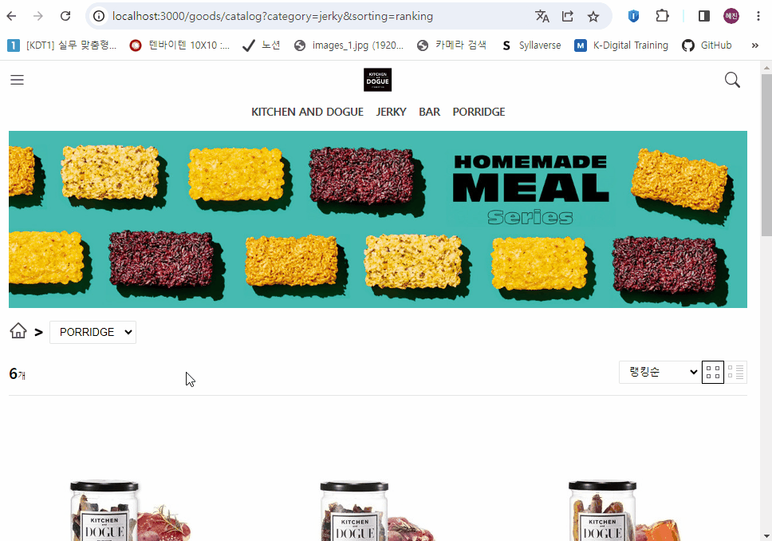

# ✔ KITCHEN and DOGUE 사이트 클론코딩 (React Project)

## 🎯 목표

-   **React**를 사용해 재사용 가능한 component를 만드는 법을 익히자
-   **Sass**을 사용해 스타일링하는 법을 익히자
-   **JSONServer** API을 통해 REST API 기반 application을 만드는 연습을 하자
-   **Redux-Toolkit, React-Redux** 라이브러리를 사용해 중앙 집중형 상태 관리 방법을 익히자
-   **Redux-Toolkit Query** 모듈을 사용해 서버와 통신하는 법을 익히자
-   **React-Router** 라이브러리를 사용해 SPA(Single Page Application)을 구현하자
-   **Responsive** Application을 구현하자

## 🧩 실습 결과물

> 참고) Navbar와 Sidebar에서 'KITCHEN AND DOGUE', 'JERKY', 'BAR', 'PORRIDGE' 외 다른 링크들은 home page로 이동하게 했음

-   배포 사이트: <>
-   KITCHEN and DOGUE 사이트 링크: <http://www.kitchendogue.com/main/index>

### 1️⃣ Home 페이지

> `화면 너비 > 992px` 일 때


> `576px < 화면 너비 <= 992px` 일 때


> `화면 너비 <= 576px` 일 때


### 2️⃣ Company 페이지


### 3️⃣ Goods 페이지

> `화면 너비 > 992px` 일 때


> `576px < 화면 너비 <= 992px` 일 때



## 💥 이슈 및 해결과정

### 1️⃣ RTK Query with React-Router

> 이슈

'/goods/catalog?category=[jerky|bar|porridge]' 경로일 때, category에 해당하는 제품을 서버에서 fetch해 화면에 render해주려고 했다. `RTK query`를 통해 goods 데이터를 가져오는 'fetchGoods' query를 작성하고 자동으로 생성된 'useFetchGoodsQuery' hook function을 react로 가져와, 위 경로로 navigate되었을 때 `react-router-dom`의 loader function에서 호출되게끔 했다.

하지만 아래와 같은 에러가 발생했고, react hook은 react component나 react custom hook이 아닌 일반 function에서는 사용할 수 없다는 것을 깨달았다.

```
Compiled with problems:
React Hook "useFetchGoodsQuery" is called in function "loader" that is neither a React function component nor a custom React Hook function.
```

> 해결방법

loader function에서 useFetchGoodsQuery hook을 사용해 자동으로 해당 action type으로 dispatch를 보내게 하는 것 대신, goodsApi의 fetchGoods thunk function을 직접 dipatch 함수를 사용해 호출하는 방식으로 이슈를 해결했다.

```js
// pages/Goods.js
const loader = ({ request }) => {
	const url = new URL(request.url);
	const category = url.searchParams.get("category");
	store.dispatch(menusApi.endpoints.fetchGoods.initiate(category));

	return null;
};
```

-   참고: [RTK Query Advanced Patterns - Fetching users manually](https://redux.js.org/tutorials/essentials/part-8-rtk-query-advanced#fetching-users-manually)
-   참고: [Using Redux Tool Kit (RTK) Query With React Router V6](https://medium.com/@bitsol/using-react-tool-kit-rtk-query-with-react-router-v6-9eac07521bc5)
-   참고: <https://codesandbox.io/s/rr6-4-rtk-auth-cdbtow?file=/src/index.tsx>
-   참고: [React Router 6 Loaders with RTK Query](https://github.com/reduxjs/redux-toolkit/discussions/2751)
-   참고: [What is difference between useQuery and initiate in RTK query?](https://stackoverflow.com/questions/74695558/what-is-difference-between-usequery-and-initiate-in-rtk-query)

### 2️⃣ React-Router를 사용해 search parameter 변경

> 이슈

search parameter로 category와 sorting 두 가지가 있고, 각각 dropdown의 선택으로 값을 변경할 수 있게 해야 했다. HTML select element를 React-Router의 Form component로 감싸 change event가 발생하면 search parameter가 변경되게 하고자 했다. sorting select를 변경하면 category search parameter는 그대로 유지된 채 sorting search parameter만 변경되어야 했다. React-Router의 `useSubmit` hook을 사용해 sorting select가 변경될 때 선택한 option으로 search parameter를 바꿔주려고 했지만, 이렇게 하면 기존 category search parameter는 사라지고 변경된 sorting search parameter만 남는 이슈가 발생했다.

> 해결방법

React-Router의 `useSubmit` hook 대신, `useSearchParams()` hook을 사용해 기존 searchParams의 값을 변경한 후 setter function으로 값을 바꿔주었다.

```js
import { useSearchParams, Form } from 'react-router-dom';

function Goods() {
  let [searchParams, setSearchParams] = useSearchParams();

  const handleSorting = function (e) {
    searchParams.set('sorting', e.target.value);
    setSearchParams(searchParams);
  }

  const handleCategory = function (e) {
    searchParams.set('category', e.target.value);
    setSearchParams(searchParams);
  }

  ...

  return (
        ...
        <Form onChange={handleSorting}>
            <Dropdown name='sorting' />
        </Form>
        <Form onChange={handleCategory}>
            <Dropdown name='category' />
        </Form>
        ...
    );
}
```

-   참고: [React Router - useSearchParams](https://reactrouter.com/en/main/hooks/use-search-params)
-   참고: [useSearchParams](https://velog.io/@rayong/%EB%A6%AC%EC%95%A1%ED%8A%B8-%EA%B8%B0%EC%B4%88-%EC%BF%BC%EB%A6%AC-%EC%8A%A4%ED%8A%B8%EB%A7%81-useSearchParams)

## 💬 느낀점 및 개선해야할 사항

### 1️⃣ 복잡한 Slider component

Slider component 하나로 <u>다양한 기능</u><small>(ex) 자동 슬라이드, 무한 슬라이드, override 슬라이드, 끝이 있는 슬라이드 등)</small>을 가진 슬라이드를 구현하려다 보니, Slider component 내 코드가 100줄이 넘어갈 정도로 매우 heavy해졌다.

어떻게 하면 이런 난잡한 Slider component를 단순화할 수 있을까 생각해보았다.

복잡한 Slider component 기능을 분리하기 위해 일단 여러 슬라이드에 '<u>공통으로 존재하는 기능</u><small>(ex) 자동 슬라이딩, next 버튼 클릭 시 다음 슬라이드로 이동 등)</small>'과 각 슬라이드마다 '<u>독립적으로 존재하는 기능</u><small>(ex) 무한 슬라이딩, override lastSlide에서 next로 이동 불가 등)</small>'을 먼저 구분해야할 것 같다.

공통으로 존재하는 기능은 Slider component에 넣고 반면 독립적으로 존재하는 기능은 상위 component<small>(ex) OverrideSlider, EndedSlider, InfiniteSlider)</small>로 따로 빼내어 Slider component에 각 특징을 담은 props를 넘겨주면 Slider component의 복잡한 코드를 개선할 수 있을 것 같다.

### 2️⃣ Components 폴더 구조

Components 폴더 안에 모든 pages에 관련된 components를 내부 폴더 구분 없이 파일로만 넣었다. 그러다보니 component를 새로 생성하면 할수록 나중에 내가 원하는 component 파일을 바로 찾기가 쉽지 않았다.

파일을 체계적으로 정리해야 할 필요성을 느끼고, 다른 개발자들은 효율적인 개발을 위해 어떻게 폴더 구조를 설계하는지 찾아보았다. 인상 깊게 본 두 가지 설계 방법을 아래 기록해 두고자 한다.

1. components 폴더 안에 feature 별로 폴더를 나눈 후, `index.js` 파일을 통해 components를 export 해주는 방식

    - 참고: [Delightful React File/Directory Structure](https://www.joshwcomeau.com/react/file-structure/)
    - `index.js` 파일을 통해 components를 export해주기 때문에, 다른 파일에서 한 component를 import할 때 경로를 상세히 적어줄 필요가 없다는 이점이 있음

2. Atomic 디자인
    - 참고: [Structuring your React Application — Atomic Design Principles](https://andela.com/insights/structuring-your-react-application-atomic-design-principles/)
    - atomic, molecule, organism, template, page 형태로 분류
    - 대형 project에서 상당히 유용할 것 같은 디자인인 것 같다

위 설계 방식 일부를 활용하여 'kitchen and dogue' project의 components 폴더를 재구조화해 보았다.

```
components
    ↳ root
        ↳ Navbar.js
        ↳ Sidebar.js
        ↳ Footer.js
        ↳ index.js
    ↳ home
        ↳ HeroSlider.js
        ↳ SubHeroSlider.js
        ↳ SignatureMenu.js
        ↳ SpecialMenu.js
        ↳ DailyMenu.js
        ↳ HomeMenuItem.js
        ↳ DailyMenuItem.js
        ↳ FixedBanner.js
        ↳ index.js
    ↳ goods
        ↳ ProductList.js
        ↳ ProductItem.js
        ↳ index.js
    ↳ ui
        ↳ Slider.js
        ↳ Dropdown.js
        ↳ index.js
```

### 3️⃣ Styles 폴더 구조

Styles 폴더도 마찬가지로 거의 component나 page 당 하나의 stylesheet를 생성하다보니 폴더 길이가 무한정 길어져 갔다.

파일을 체계적으로 정리해야 할 필요성을 느끼고 Styles 폴더 구조 설계 방법을 찾아보다가 `7-1 pattern`에 대해서 알게 되었다.

여기서 '7'은 abstracts, vendors, base, layout, components, pages, themes 총 7개의 폴더를 의미하고, '1'은 각 css 파일을 모아 export하는 main.css 한 개의 파일을 의미한다.

```
sass/
|
|– abstracts/
|   |– _variables.scss    # Sass Variables
|   |– _functions.scss    # Sass Functions
|   |– _mixins.scss       # Sass Mixins
|   |– _placeholders.scss # Sass Placeholders
|
|– base/
|   |– _reset.scss        # Reset/normalize
|   |– _typography.scss   # Typography rules
|   …                     # Etc.
|
|– components/
|   |– _buttons.scss      # Buttons
|   |– _carousel.scss     # Carousel
|   |– _cover.scss        # Cover
|   |– _dropdown.scss     # Dropdown
|   …                     # Etc.
|
|– layout/
|   |– _navigation.scss   # Navigation
|   |– _grid.scss         # Grid system
|   |– _header.scss       # Header
|   |– _footer.scss       # Footer
|   |– _sidebar.scss      # Sidebar
|   |– _forms.scss        # Forms
|   …                     # Etc.
|
|– pages/
|   |– _home.scss         # Home specific styles
|   |– _contact.scss      # Contact specific styles
|   …                     # Etc.
|
|– themes/
|   |– _theme.scss        # Default theme
|   |– _admin.scss        # Admin theme
|   …                     # Etc.
|
|– vendors/
|   |– _bootstrap.scss    # Bootstrap
|   |– _jquery-ui.scss    # jQuery UI
|   …                     # Etc.
|
`– main.scss              # Main Sass file
```

-   참고: [Sass Guideline - Architecture](https://sass-guidelin.es/#architecture)

### 4️⃣ Data Loading/Error 처리

현재는 서버로부터 데이터를 fetch해올 때 Loading이나 Error 발생 시 'loading'/'error' string을 반환하는 식으로 처리를 해주고 있다. 데이터 loading 시 spinner animation을 뜨게 하거나, error가 발생했을 땐 error page를 띄우게 나중에 추가 구현을 해야할 것 같다.

React-Router에 loading/error와 관련된 기능이 있어 이를 이용하면 쉽게 구현할 수 있을 것 같다. React-Router의 errorElement 속성을 이용하면 error가 발생했을 때 error page를 띄울 수 있다. 또한 React-Router의 useNavigation hook을 사용하면 현 navigation state가 'loading'인지를 파악할 수 있고, 이를 이용해 직접 loading 처리를 해줄 수 있다.

### 5️⃣ React project와 JSON Server 배포

현재 kitchen-dogue 폴더는 CRA에 의해 생성된 React project이고, 이 안에서 json-server 라이브러리를 설치해 `db.json`을 저장한 상태이다. 개발을 끝내고 'Netlify'를 통해 JSON server와 함께 React project를 배포할 예정이었지만, 'Netlify'에서는 JSON Server가 작동하지 않는다는 것을 깨달았다. JSON server와 함께 React project를 배포할 수 있는 다른 배포 사이트에 대해서 찾아보았고, 'Heroku'를 사용하면 가능하다는 게시글을 보았지만 2022년 말부터 유료화되었기 때문에 사용하지 못했다. 또 다른 배포 사이트를 찾아보다가 'Vercel'이라는 것을 알게 되었고, 여기에 JSON Server와 React Project를 각각 분리해서 배포한 후, React Project에서 JSON Server를 배포한 URL을 참조하면 되지 않을까 싶어 시도해 보았다.

-   참고: [JSON Server Doesn’t Work on Netlify](https://answers.netlify.com/t/json-server-doesnt-work-on-netlify/32351)
-   참고: [How to Deploy a React Site with Vercel](https://vercel.com/guides/deploying-react-with-vercel)
-   참고: [Deploying your first React app a with json-server backend on Heroku and Netlify](https://dev.to/jaguilar89/deploying-your-first-react-app-a-with-json-server-backend-on-heroku-and-netlify-anj)
-   참고: [Create RESTful API with JSON Server and deploy it to Vercel](https://ivo-culic.medium.com/create-restful-api-with-json-server-and-deploy-it-to-vercel-d56061c1157a)
-   참고: <https://github.com/kitloong/json-server-vercel>

## 📁 참고자료

-   [React Router](https://reactrouter.com/en/main)
-   [How to Build a React App – A Walkthrough of the Many Different Ways](https://www.freecodecamp.org/news/how-to-build-a-react-app-different-ways/)
-   [Netlify - React on Netlify](https://docs.netlify.com/integrations/frameworks/react/)
